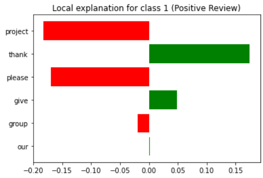

# SC5010 Movie Review Analysis: Sentiment Classification of Movie Reviews

There has been a keen interest in Natural Language Processing or Text Analytics in the data analytics field for a long time. Here, we intend to use what we have learnt from the course (plus a little bit more) to analyse this seemingly simple dataset and see what we can make of it given our current skillsets.


***

## Table of contents

* [General Info](#general-info)
* [Technologies](#technologies)
* [Project Objective](#project-objective)
* [Dataset](#dataset)
* [Methodology](#methodology)
* [Results Analysis](#results-analysis)
* [Further Testing](#further-testing-with-tf-idf-logreg)
* [Conclusions](#conclusions)

***

### General Info

This README contains the documentation of the SC5010 Project which is contributed by **Deng Cheng**, **Jovan Teo** and **Soon Qing Rong**.

&nbsp;

### Technologies

The project is created using:

* Python version: 3.8.5
* Sheer Willpower

***

### Project Objective

We aim to be able to accurately predict the sentiments (positive or negative) of a string of text, based on our analysis of the movie review dataset. 

&nbsp;

### Dataset

We use an IMDB Dataset of 50,000 Movie Reviews obtained from [Kaggle](https://www.kaggle.com/datasets/lakshmi25npathi/imdb-dataset-of-50k-movie-reviews). 
This dataset has 2 columns, highlighted as follows. 

| Column Name | Data Type                       |
| ----------- | -----------                     |
| *review*    | String                          |
| *sentiment* | String: "positive" or "negative"| 

&nbsp;

### Methodology

##### Data Cleaning (from Dataframe)

1. Set Class 1 for Positive Review and Class 0 for Negative Review

2. Drop null values

3. Drop duplicates

&nbsp; 

##### Data Cleaning (Text-Preprocessing)

1. Convert all text to lowercase for each review

2. Remove HTML tags

3. Only keep characters (a - z and A - Z) for each review

4. Perform lemmatization

&nbsp;

##### Data Visualisation 

A word cloud and bar chart for the 15 top most common vocabulary is visualised for each of the below subsections: 

1. For reviews without removing stopwords 

    a. Only positive reviews

    b. Only negative reviews

    c. Both positive and negative reviews


2. For reviews with stopwords removed

    a. Only positive reviews

    b. Only negative reviews

    c. Both positive and negative reviews reviews

&nbsp;

##### Data Preparation for model training 

1. Remove stopwords for each review 

2. All reviews are split into 80% training sentences and 20% test sentences, and their corresponding labels will also be split accordingly

&nbsp; 

We use 2 models: Logistic Regression (LogReg) and Convolutional Neural Network (CNN). Since our data is in text form, we will be vectorising the review column through various embedding methods in preperation for analysis. 

&nbsp; 

##### Evaluation of Text Embedding models and Logistic Regression Classification model using Cross-Validation

1. 3 text embedding models will be used where the text embedding models will vectorize the training sentences into vectors. These vectors, together with the labels, will be fitted to LogReg.
  
> a. **One-Hot Encoding** (Count whether the word is in review or not: 1 if in review and 0 if not) is used to vectorize the training sentences and put into logistic regression model for classification in Stratified 5-Fold Cross-Validation

> b. **Bag-of-Words** (Count number of occurrences of the words in review) is used to vectorize the training sentences and put into logistic regression model for classification in Stratified 5-Fold Cross-Validation

> c. **TF-IDF** (Bag-of-Words vectorization multiplied by normalisation term) is used to vectorize the training sentences and put into logistic regression model for classification in Stratified 5-Fold Cross-Validation
 
&nbsp;

2. Stratified 5-Fold Cross-Validation will be used where a normal 5-Fold Cross-Validation is used and the split at each fold will have the ratio of the 2 classes maintained via Stratified Sampling.

> a. Only the 80% of the original given data will be used, and for this section, this 80% of the original given dataset will be called the **original training sentences**

> b. For each of the 5 folds, 80% of the **original training sentences** will be used to train the text embedding models and classification model while 20% of the **original training sentences** will be kept aside for prediction

> c. At each fold, the 80% of the **original training sentences** will first be used to fit the text embedding model

> d. This text embedding model will then be used to transform the 80% of the **original training sentences** into the train vectors for the fold

> e. This text embedding model will also be used to to transform the 20% of the **original training sentences** into the test vectors for the fold

> f. The train vectors, together with the train labels will be used to fit the classification model and this classification model will then have its **Accuracy** and **F1 Score** taken down when predicting the test vectors and compared to the test labels

> g. The **Average Accuracy** and **Average F1 Score** across 5-Folds will be used for comparison

&nbsp;

##### Evaluation of Text Embedding models and Convolutional Neural Network Classification model

1. Due to technical limitations[^*] , only **One-Hot Encoding** will be used for this analysis model.
2. CNN[^**] works by multiplying a matrix of values with kernels (a set of predetermined weights). There are multiple layers of such kernels present such that, at each layer, some feature of the input is extracted. In the end, the input data is decomposed to a single output.
> a. Sequential Model: A container of a linear stack of layers, or filters
 
> b. Embedding Layer: Compresses the input vector. Here we take a maximum of 1000 words from the vocabulary, with a vector space of 32

> c. Conv1D Layer: Convolution operator used to filter the neighbour of 1-D neighbourhoods

> d. Max Pooling Layer: Downsamples the input to reduce computation

> e. Dropout Layer: A regularisation method that removes random outputs to avoid overfitting and improve overall model accuracy 

> f. Flatten Layer: Converts the previous output to a 1-D vector to be used as inputs in the Dense Layers

> g. Dense Layer: Hidden (Deep) layers that generate the final output of 'positive' or 'negative' on a continuous scale between 0 and 1


[^*]: Bag-of-Words and TF-IDF training vectors (sparse matrix) as obtained from the LogReg embedding were too RAM-consuming to convert to the type accepted (dense array or matrix) by the Keras NN model. I crashed Colab more than 10 times. 


[^**]: This is as brief a description of CNN I am able to muster without diving in too deep. I am by no means very knowledgeable about CNN, it was merely a very interesting classification method I would like to try. For anyone who may be reading this from my GitHub, I think [3Blue1Brown](https://www.youtube.com/watch?v=aircAruvnKk) is a very good start into the topic. 

&nbsp;

### Results Analysis

##### LogReg

| | One-Hot <br /> Encoding | Bag-of-Words | TF-IDF |
| :-: | :-: | :-: | :-: | 
| Average Accuracy <br />(Across 5 folds) | 0.880 | 0.881 | <u>0.893 |
| Average F1 Score <br />(Across 5 folds) | 0.881 | 0.882 | <u>0.894 |

##### CNN

| | One-Hot <br /> Encoding |
| :-: | :-: |
| Accuracy | 0.797 |
| F1 Score | 0.786| 

Since the TF-IDF with LogReg gives us the highest average accuracy and F1 Score throughout the models, it may give us the best testing results. We train the LogReg model with TF-IDF Embedding as follows:

1. TF-IDF is fitted to the whole of the training sentences (80% of original dataset) into vectors, it will then be used to transform the given test sentences into vectors

2. The vectors from the training sentences is then used to fit the Logistic Regression Model with the training labels

3. LogReg Model is used to predict the outcome of some test sentences given the vectors from these test sentences

We obtain the following result:

| | Accuracy | F1 Score |
| :-: | :-: | :-: |
| Train Set | 0.932 | 0.933 |
| Test Set | 0.889 | 0.889 |

  

Overall, with high accuracy and F1 score, it appears that TF-IDF with LogReg is able to give us a satisfactory classification of review sentiments.  

### Further Testing with TF-IDF LogReg  

<!-- >>> seriously i don't know why we even do this part    -->

To verify the reliability of our model, we used Cosine Similarity to identify top 5 most 'similar' reviews to a randomly determined review. Our metric is as follows: Should our model be reliable, similar reviews should all have the same predicted labels and similar probability of being classified as a positive review.

In one instance, we selected review #5049 and identified #677, #8900, #2464, #3448, and #1266 to be its closest reviews. 


    Statement with index 677
    Cosine similarity with index 5049: 0.475
    Actual label: 0 (Negative Review)
    Predicted label: 0 (Negative Review)
    Probability of review being classified as 1 (Positive Review): 0.0877

    Statement with index 8900
    Cosine similarity with index 5049: 0.382
    Actual label: 0 (Negative Review)
    Predicted label: 0 (Negative Review)
    Probability of review being classified as 1 (Positive Review): 0.3858

    Statement with index 2464
    Cosine similarity with index 5049: 0.371
    Actual label: 0 (Negative Review)
    Predicted label: 0 (Negative Review)
    Probability of review being classified as 1 (Positive Review): 0.068

    Statement with index 3448
    Cosine similarity with index 5049: 0.312
    Actual label: 0 (Negative Review)
    Predicted label: 0 (Negative Review)
    Probability of review being classified as 1 (Positive Review): 0.2088

    Statement with index 1266
    Cosine similarity with index 5049: 0.241  
    Actual label: 0 (Negative Review)
    Predicted label: 0 (Negative Review)
    Probability of review being classified as 1 (Positive Review): 0.1571  

The above statements are all correctly predicted to be negative reviews. At the same time, they all share a relatively low probability of being wrongly classified as a positive review, to be within a range of 0.3178. While on the wider side, this range also takes into account our metric of similarity to be the cosine similarity and it may not be the most effective at measuring textual similarity. Regardless, as our model still ends up correctly predicting the sentiments of these similar reviews, we still deem it as sufficiently reliable. Repeating this process for other reviews yields similar results[^***].  

<!-- >>> seriously i don't know why we even do this part    -->

[^***]: Ideally, it would be the case that we go through the above process for all our reviews (or at least a percentage of) and measure the variation in ranges to be able to obtain fuller overview of our model's performance. This was however halted by, once again, technical difficulties as it would imply we do a nested for-loop over 50000 rows ```[O(n^2)]```. 

Using **Lime** (Local Interpretable Model-agnostic Explanations), it is possible to see which words in a given sentence (reviews) will encourage the model to predict it as Class 1 (Positive Review) or Class 0 (Negative Review).

For instance, the review (after stopword removal)

   ```... mickey rourke wa famous movie star play martin fallon ira terrorist accidentally blow school bus full child disgusted action decides leave ira go run london mild spoiler movie opening rather disturbing life little child ended fireball thing like happened throughout northern ...```

gives us

 

and the output 

```Probability of review being classified as 1 (Positive Review): 0.145```.


Additionally, using Lime, it is possible to handcraft our own sentences to see if our models can predict it as a positive or negative review, and if so, what words contribute to the model’s prediction. However, this then presents our limitations for the model as it is not difficult to manipulate our vocabulary in order to produce a wrong outcome, hence rendering the result inaccurate. Putting in a test sentence,

```Dr Smitha and Dr Sourav please give our group project an A thank you!```

we obtain a prediction of a negative sentiment.

```Probability of review being classified as 1 (Positive Review): 0.3118```

 

This is likely due to our test sentence using vocabularly rarely seen throughout the train dataset, so there is greater difficulty in judging 'goodness' of such vocabulary. This is a general limitation of Natural Language Processing, so it is certainly difficult to judge this sentence accurately based on current training alone. 

Additionally, another failure of the model would be to test on complicated sentence structures which understanding relies on syntax, such as double negatives. In cases such as these, it may not be as appropriate to use LogReg as it appears that our current model predicts sentiments based off the sentiments individual words, rather than greater context. 


&nbsp;

### Conclusions 

##### Overview

From the original dataset that was given, we attempted to clean the data by dropping null rows as well as duplicates. As this is textual data, we have also attempted to do some text pre-processing by first making all words into lower case. We also attempted to remove HMTL tags, performed lemmatization, kept only characters, and removed stop words.

These reviews were then put into text embedding models and classification models to see if it is possible to use machine learning techniques to help predict whether certain reviews are positive or negative.

Finally, we use Lime to find the words that contribute significantly to the model’s final prediction. This gives us a better insight as to what may be a deterministic factor in our model's classification of sentiments.

##### Final Statement

Overall, we have found LogReg using TF-IDF as an embedding model to be most suitable for our purpose. It was able to achieve a satisfactory 89.3% accuracy across 5 folds and 88.9% accuracy on our test set.

Using Lime, we were also able to identify what kind of words would help classify our sentences as positive or negative. We learnt that while our model was able to classify most of the individual words correctly, it had trouble accurately determining sentiments of words with no clear meanings and hence may not necessarily do well in contextual sentences.

Nevertheless, it remains that our LogReg with TF-IDF model will likely fare well on reviews as long as it contains vocabularly covered by our current vocabulary list and does not use overcomplicated syntax. In this aspect, we have definitely achieved our initial objective of using our model to predict sentiments from text paragraphs. 

